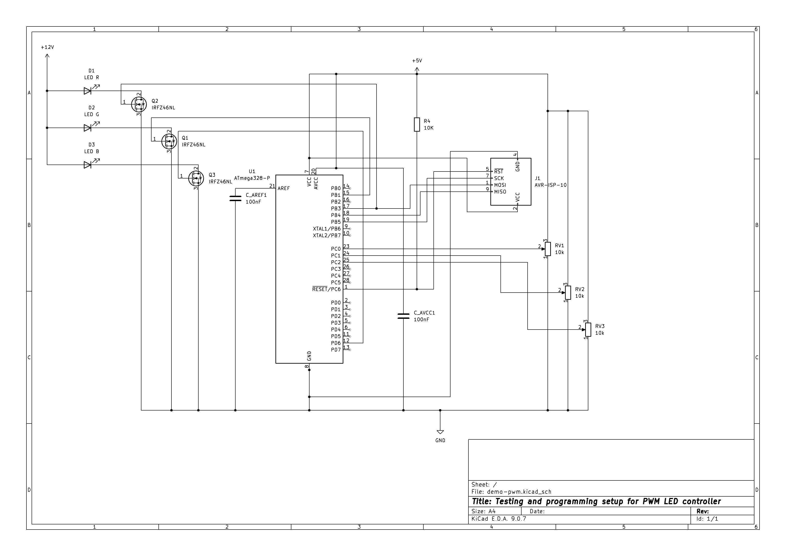
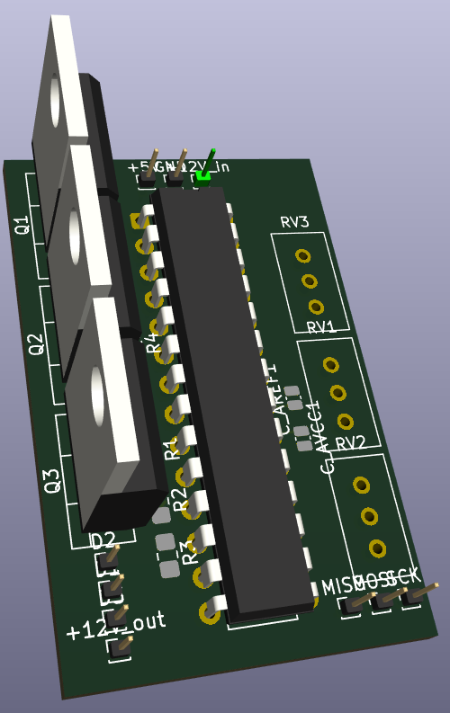

# Steps taken here:
Datasheet: https://ww1.microchip.com/downloads/en/DeviceDoc/Atmel-7810-Automotive-Microcontrollers-ATmega328P_Datasheet.pdf
1) Made the schema:

|  |
| :--: |
| ATmega328p has 5 Analog to digital comversion inputs and 6 Pulse Width Modulation outputs. Im using here ADC:s 0-2 and PWM timer outputs OC0A, OC1A OC2A to control RGB LED strip. |
1) Installed and set up development environment:
```sudo apt-get update && sudo apt-get install -y avr-libc gcc-avr avrdude make usbutils binutils-avr libc6-dev```
2) Olimex SPI is set to use +5V VCC. The SPI needs refrenece VCC and GND to be connected to MCU in order to get the signal levels right.
3) Pulled up RESET permanently with a resistor connected to VCC.
4) Connected USB UART device to Rx/Rt and GND for debugging ADC result in terminal (see code in adc branch)
5) Added two capasitors, C_Aref and C_AVCC for decoupling purposes so the VCC dont AVCC dont tank under heavy load - Compansates the inductance
6) Programmed the fuses for BODLEVEL etc. (see Makefile):
```make fuse```
7) Code changes are programmed to flash using:
```make flash```
- You can check if all the libraries are included using:
```make```
8) Some prototyping usin kiCad:
TODO: Try IRLZ44N MOSFET for more close to Gate Off = 0V results

|  |
|:--:|
| *note: I used the wiring of my ready made LED strip - not my choice! :D* |
